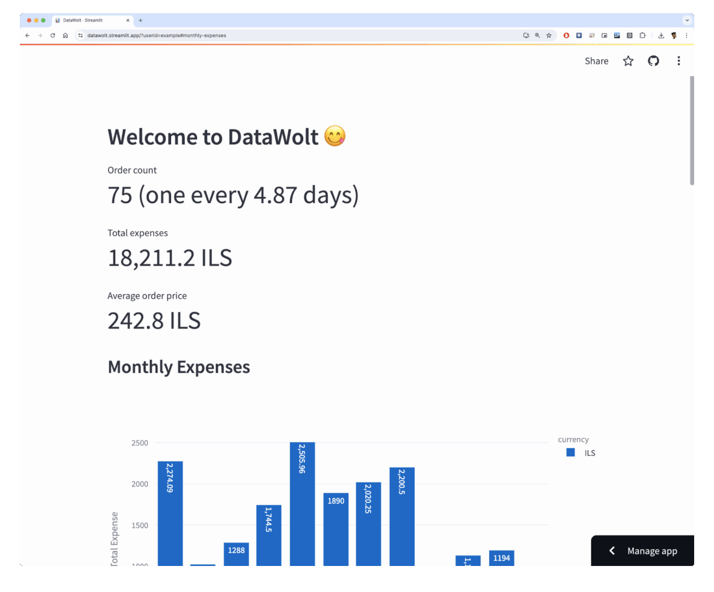

# Welcome to DataWolt :yum:

* Datawolt is a Streamlit app that visualizes your last 12 months of Wolt delivery data.
* To get started you need to install the Datawolt [Chrome extension](https://chromewebstore.google.com/detail/datawolt/blphmcckpkfeekccpikldelpmiojknmb).
* Once you have the extension installed visit the Wolt [order history webpage](https://wolt.com/me/order-history).
* The extension will automatically pull your order history, display an alert when it's done processing it and forward your browser to your personal dashboard.
* You can share your dashboard with others by sharing the URL. The URL contains a hashed version of your Wolt user id.
* Sample dashboard can be viewed [here](https://datawolt.streamlit.app/?userid=example).

#### Privacy and security
* Datawolt is **completely open-source** and the entire codebase can be viewed on [GitHub](https://github.com/idoavrah/datawolt).
* Datawolt **does not store** any of your identifiable personal data.
* Datawolt uses your temporary credentials to pull your order data from Wolt but saves only the relevant parts (orders, items, prices and restaurant names and locations). UserId is hashed, credentials are not saved anywhere.
* Your dashboard has a public endpoint and can be viewed by others if they know your hash-generated userid or if you share your URL. This generated userid is basically impossible to guess and cannot be traced back to the original Wolt user id or your username / e-mail.

